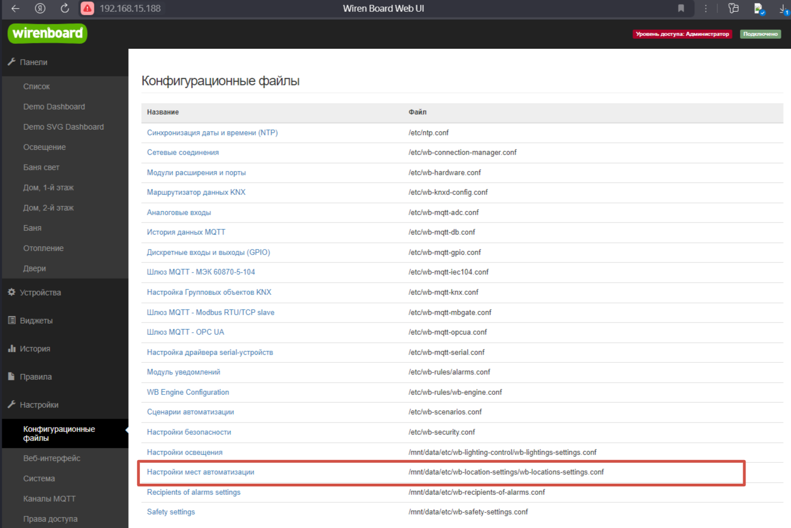
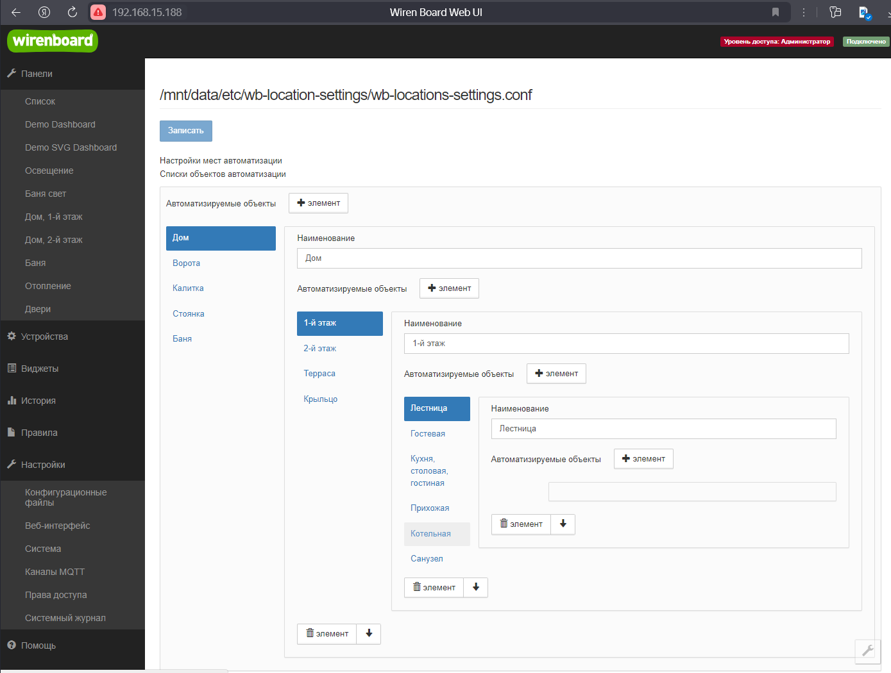

Набор файлов для WirenBoard, позволяющий задать иерархический список мест автоматизации с помощью редактора конфигурационных файлов.
Как попробовать:
1. Перенести папку 'wb-location-settings' со всеми файлами в '/mnt/data/etc.
2. Выполнить скрипт начальной инициализации
 ```bash
/mnt/data/etc/wb-location-settings/initial-setup.sh
```

   
После этого можно идти в настройки, выбирать пункт 'места автоматизации' и создавать списки мест.


